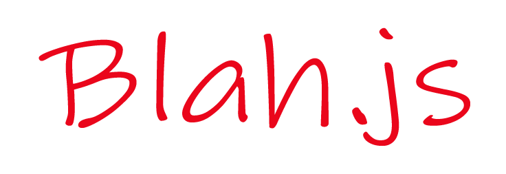

<a name="readme-top"></a>


<br />
<div align="center">
  <a href="https://github.com/othneildrew/Best-README-Template">
    
  </a>

  <h3 align="center">Blah.js</h3>

  <p align="center">
    Toy Library for creating Web Components
    <br />
    <br />
    <a href="https://codesandbox.io/s/blah-js-example-51gtye?file=/app.blah">View Demo</a>
    ·
    <a href="https://github.com/Sarfraz-droid/blah.js/issues">Report Bug</a>
    ·
    <a href="https://github.com/Sarfraz-droid/blah.js/issues">Request Feature</a>
  </p>
</div>

---
<!-- ABOUT THE PROJECT -->
## About The Project


This is a software development library designed to assemble user interfaces with the capability of dynamically rendering data. The library is developed using Typescript and is bundled with Parcel. The system supports code-sharing functionality with files that have a **.blah** file extension. Efficient updates to the Document Object Model (DOM) are processed through an identification-based element tracking method.

Why to use Blah.js?
* Code-Sharing & Splitting
* Dynamic Variables and Functions

<p align="right">(<a href="#readme-top">back to top</a>)</p>


### Built With


<p align="right">(<a href="#readme-top">back to top</a>)</p>


<!-- GETTING STARTED -->
## Getting Started

How to get started

### Prerequisites

* npm
  ```sh
  npm install npm@latest -g
  ```

### Installation

_Below is an example of how you can instruct your audience on installing and setting up your app. This template doesn't rely on any external dependencies or services._

1. Install the package by running
  ```sh
    npm i @sarf_alam/blahjs
  ```
  or use the cdn by embedding in the html
  ```html
      <script src="https://unpkg.com/@sarf_alam/blahjs/build/global.js"></script>
  ```
2. Configure Blah.js by
   ```sh
    Blah.StartApp('app');
   ```
3. You project has been set up, now you can see your changes by the adding `<blah.template>` given below
   ```html
    <div id="app">
      <blah.template path="app.blah" />
    </div>    
   ```
   
   similarly your app.blah contains the code in the following format
   ```html
     <template>
      <h1>
        Hello World
      </h1>
    </template>

    <script>
     // Add your JS Code here
    </script>
   ```


For more such examples you can check out the deployed website at https://sarfraz-droid.github.io/blah.js/

<p align="right">(<a href="#readme-top">back to top</a>)</p>


> Currently in development
